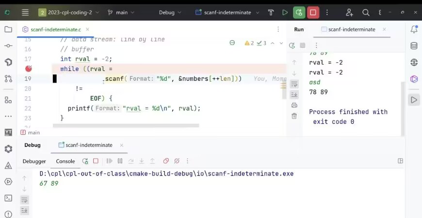

# Week1 输入与输出 + Debug

[TOC]

## 0.省流
| 数据类型         | 表示范围                                           | 格式串 |
| ---------------------- | ----- | ------ |
| 整数（int）      | int: -2^31到2^31-1 | %d     |
| 范围更大的整数(long long) | -2^63到2^63-1 | %lld |
| 单精度浮点数 (float) | 大约1.18 x 10^-38 到 3.40 x 10^38 | %f |
| 双精度浮点数 (double) | 大约2.23 x 10^-308 到 1.80 x 10^308 | %lf |
| 单个字符 (char)        | 实际上是8位整数，-128 - 127 （ASCII码中只取0-127） | %c |
| 字符串 (char[])        |       | %s |

注：你无需精确记住上面的范围，但需要有个大概的印象。

整数的话，一般在二十亿($ 2*10^9 $)以内用int即可，更大则用long long.

至于浮点数，double精度更高，初学时建议全部使用它。

浮点数有**精度损失**，如果需要的结果是个整数，且在整数表示范围内，优先用int/long long


scanf中的变量，**除了字符串变量**,其他均要加&(取地址符)， e.g scanf("%d",**&**a)


scanf中只有**%c**不会跳过空白符，其他会跳过空白符('\0', ' ', '\n', '\t'等)

getchar()**不会跳过**空白符


如何处理不定行读入([关于返回值](#关于返回值))


## 1.前言
scanf/printf本质上是将保存/加载变量中的值，但在此之前还是飞快地回顾下什么是变量：

（别问我为什么老师上课不讲这些，可能是默认大家都会）

变量就是计算机世界中用来存储数据的东西，根据存储类型的不同，分为int(整数)，float(小数，浮点数)，char(字符)，string(字符串)

变量可以被重新赋值(Line 3), 也可以被读取其值并使用(Line 5)，但最关键的，必须要**先声明后使用**(Line 2)

```
int main() {
    int 年龄; // 声明一个名为“年龄”的变量（注意如果没有这句话会报错）
    年龄 = 18; // 把数字18存放到名为“年龄”的变量中

    printf("我的年龄是：%d\n", 年龄); // 输出变量“年龄”的值
    return 0;
}
```

如果你删去Line 3，就会发现Line 5打印出了极其诡异的值。这是因为，**变量如果只被声明而从未赋值，那它就会存储一个垃圾值。**

这也提醒我们，**变量声明时一定要初始化**(至少新手期最好这样做)

**（建议了解：变量的命名规范，变量的运算，尤其是取模运算， ASCII码）**

但很明显，上面的程序依然是一段写死的程序，它无法和我们进行交互，换句话说，无法我们怎么敲键盘，输出永远是固定的。所以，我们有必要先了解下输入输出(IO)，让计算机能处理不同的数据。


## 2.IO详解
### I.printf
主要是先讲格式串
```c
printf(string format,...);
//数量一定要对，否则会出问题，但不报错

// 整数 %d,%x,%o
int a = 100;
printf("%d-%x-%o\n",a,a,a);

// 长整数longlong %lld
long long big_int = 3000000000LL;
printf("%lld-%d\n",big_int,big_int);

// 浮点数
float f = 1.5;
double d = 1.6;
printf("%f-%lf-%f-%lf",f,f,d,d);
//这俩好像没啥区别，但最好还是对应起来
//精度如何表示？

//字符,字符串
//每一个字符(%c),都对应一个ASCII码(%d)
char a = '1';
int b = 64;
printf("%c-%d",a,a);
printf("%c-%d",b,b);

char str1[10] = "HELLO";
char str2[10] = {'h','e','l','l','o'};
printf("%s %s",str1,str2);

//转义字符
printf("\'\\1\\\'\n\"\t2%%\"");
```

### II.scanf

它的基本使用和printf一样，但是请注意scanf中的变量，**除了字符串变量**,其他均要加&(取地址符)， e.g scanf("%d",**&**a)

#### 什么是空白符
诸如空格(' ')，回车('\n')，制表('\t')，'\0'等符号

#### 占位符的匹配
##### 何时开始？
**%d,%s等在匹配前会忽略所有的空白符**，
对于scanf("%d%d%d%d",&a,&b,&c,&d); (**注意&**)
管你中间加多少空格，换几行，反正我只找4个整数

but %c除外，当前字符是什么我就读什么

##### 何时结束？
%d,%s这些遇到空白符就自动停了，另外如果这个字符不是我想要的，也会停
%c反正只读一个字符

#### 运作原理(建议学完再来看)

**注意：下面的内容不是必学的，但是了解它会让你更方便debug**

首先要知道他是怎么运作的：
目标串记为s,输入串记为t;

对t进行扫描，如果当前希望匹配：
1.普通字符，一一匹配
2.占位符，不断地向后看t(略过中间的空白符)，直到不能匹配为止(贪心匹配)
但如果什么都没匹配上的话，那就说明出问题了，scanf会直接结束。
3.空格,如果匹配失败直接跳过

##### 练习
```C
int a=0,b=1,c=2,d=3;
scanf("%d/%d/%d %d",&a,&b,&c,&d);
//test data1:08/08/90 4
//test data2:08 08 90 4
//test data3:08 08/90 4
printf("a=%d,b=%d,c=%d,d=%d",a,b,c,d);

int a=0,b=1,c=2,d=3;
scanf("%d %d %d %d",&a,&b,&c,&d);
//test data1:08 08 90 4
//test data2:08 08/90 4
printf("a=%d,b=%d,c=%d,d=%d",a,b,c,d);


int a=0,c=1;
char b='b',d='d';
scanf("%d %c %d%c",&a,&b,&c,&d);
//test data1:2b2t
//test data2:2 b 2 t
//test data3:2c /.2t
//test data4:cccc      output:a=0,b=b,c=1,d=d
//test data5:/20 / 3+
//test data5:23 14/5
printf("a=%d,b=%c,c=%d,d=%c",a,b,c,d);
//结论：scanf中的内容一旦与输入不匹配，scanf便会终止运行。
```


#### 关于返回值
匹配成功的话，返回的是匹配成功的变量数，
失败则会返回EOF(End Of File)
因此我们可以利用这个性质来进行不定行读取,一般格式如下：



## 3.debug
这里以VSCode为例讲解其自带的调试功能，其他的IDE应该也有类似的方式

printf插桩大法好！


## 4.习题

# T1：请找出下面程序的问题：(不止一处)

```C
char s[105];
int main()
{   
    int a;
    long long b;
    char c;
    double d;
    scanf("%d %lld %lf%c %s",&a,&b,&d,&c,&s);
    printf("%d %d %lf %c %s",a,b,d,c,s);
}
/* input:
1234567890
12345678900000
3.1415926535
G
Hello,World!
*/

```


# **T2 读入练习**

# Description
只有一个用例，面向用例编程即可。

读入下面的内容,**输出其中所有的字母内容，丢弃其他内容**,
**在处理完每行输入后，你需要输出一个换行**

毕竟这是练习，请尽可能多的使用不同的输入输出方式。

# Samples

### input1

```input1
abcdefg
abc def
1234efg
12abc34
q1w2e3r4
congrats!!
```

### output1

```output1
abcdefg
abcdef
efg
abc
qwer
congrats
```
