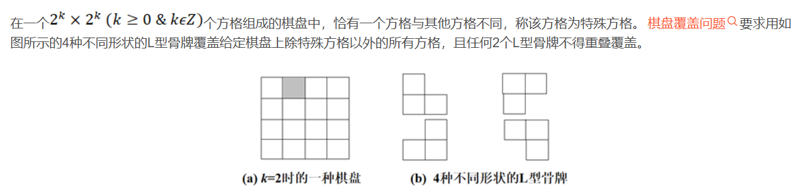

## 矩阵覆盖问题



我们现在有四种大小为3个格子的骨牌(如图B),标号分别1到4，如果将L块连接另外两个的那格称为中心格的话，那么这四种骨牌可以这样描述：(注意下面的x表示行，y表示列)

1号骨牌(图B左上角)： 如果中心点坐标为(x,y), 那么他将覆盖**(x,y), (x-1,y), (x,y+1)**三个格子

2号骨牌(图B右上角)：如果中心点坐标为(x,y)，那么它将覆盖**(x,y), (x+1,y), (x,y+1)**三个格子。

3号骨牌(图B左下角)：如果中心点坐标为(x,y)，那么它将覆盖**(x,y), (x-1,y), (x,y-1)**三个格子。

4号骨牌(图B右下角)：如果中心点坐标为(x,y)，那么它将覆盖**(x,y), (x+1,y), (x,y-1)**三个格子。

#### 输入格式:

第一行包含一个整数 *k* (1 <= k <= 10)，表示棋盘的大小是 2^k^ x 2^k^ 。
接下来 2^k^行每行包含 2^k^ 个字符，‘.’ 表示普通方格，‘X’ 表示特殊方格。**保证整个棋盘有且仅有一个‘X’**

#### 输出格式:

对于每个放置的L型骨牌，先输出一个整数n，表示你要放几个骨牌。

然后接下来n行，每行输出一行结果，格式为 “id x y”，其中 id 是 L 型骨牌的种类（1 到 4），x 和 y 分别是该骨牌中心点坐标。

如果有多种答案，你可以输出任何一种

### input1

```
2
.X..
....
....
....
```

### output1

```output1
3 3 3
1 2 1
4 1 4
1 4 1
3 4 4
```

### 样例1解释：
输入就是题目描述中的图片，根据输出内容，打印出来棋盘大概长这样：

1X44
1134
1333
1133


### 附加提示

提示1： 快速获取2的k次方：这样写： **(1<<k)**  （如果你不熟悉优先级建议每个右移都加上括号）

提示2： 由于这道题确实细节较多，我们为您特意准备了checker程序，你只需要在main函数调用即可，但可能需要稍微做些调整

```C
typedef struct {
    int id;
    int x;
    int y;
}Tile;

char s[2005][2005]
Tile ans[1000005];
// 右上1， 右下2， 左上3,  左下4
int d[4][3][2] = {
    {{0,0}, {-1,0}, {0,1}},
    {{0,0}, {1,0}, {0,1}},
    {{0,0}, {-1,0}, {0,-1}},
    {{0,0}, {1,0}, {0,-1}}
};

void check(){
    // tot表示你的答案，ans[1]~ans[tot]表示你的答案
    // s横纵坐标都从0开始，同时答案里的x,y也都是从0开始
    for(int i=1;i<=tot;i++){
        int x = ans[i].x, y = ans[i].y, type = ans[i].id;
        for(int z=0;z<3;z++){
            int nx = x + d[type-1][z][0];
            int ny = y + d[type-1][z][1];
            // 如果你想判越界就打开下面的注释
            // if(nx < 0 || nx >= (1<<k) || ny < 0 || ny >= (1<<k)){
            //     printf("error\n");
            //     exit(0);
            // }
            // if(s[nx][ny] == 'X'){
            //     printf("error\n");
            //     exit(0);
            // }
            s[nx][ny] = type + '0';
        }
    }
    for(int i=0;i<(1<<k);i++){
       printf("%s\n", s[i]);
    }
}
```


